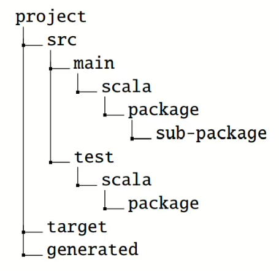

# Chisel学习

- 使用chisel实现单周期CPU

- /c2elf中说明了如何从C程序编译为可在该CPU上运行的可执行文件

- 运行：sbt "testOnly fetch.HexTest"


## chisel基础

#### 背景

chisel与verilog都属于硬件描述语言（HDL），而HLS一种高级综合工具。

而chisel与verilog**可能**类似于Python与C？


#### 模板

通常chisel项目都使用统一的模板：[Chisel-template](https://github.com/chipsalliance/chisel-template)


#### 基础用法

##### 信号类型

```scala
UInt(8.W)     //括号中数字表示位数
SInt(10.W)
Bool()
// 比如Core.scala 29行中的定义的跳转目的地：
val br_target = Wire(UInt(WORD_LEN.W))
```

##### 常量

```scala
0.U		//定义了一个UInt类型的常量0
-3.S	//定义了一个SInt类型的常量-3
3.U(4.W)	//定义了一个位宽为4的UInt类型常量3，未指定宽度时采用最小宽度
// 如Consts.scala中的一系列常量定义
val EXE_FUN_LEN     = 5
val ALU_X           = 0.U(EXE_FUN_LEN.W)
```

##### 运算/组合逻辑

```scala
//算术运算与位运算
val add = a + b		// 加法,对于加减法，结果宽度为操作数中最宽的那个宽度
val sub = a - b		// 减法
val neg = -a		// 取相反数
val mul = a * b		// 乘法,对于乘法，结果宽度为操作数的宽度之和
val div = a / b		// 除法,对于除法和取余，结果宽度通常为被除数的宽度
val mod = a % b		// 取余
val and = a & b		// 按位与
val or = a | b		// 按位或
val xor = a ^ b		// 按位异或
val not = ~a		// 按位取反
val shiftleft = a << b
val shiftright = a >> b

//逻辑运算符是针对Bool类型的：&& || ！ 与或非

//比较运算符返回Bool类型，其中需要注意等于与非等于
a === b //判断是否等于
a =/= b //判断是否不相等

//规约运算，对操作数的每一位进行规约运算，返回值为Bool类型
val allSet = x.andR		// 与规约
val anySet = x.orR		// 或规约
val parity = x.xorR		// 异或规约

//位字段操作符
val xLSB = x(0)		// 提取x的最低位
val xTopNibble = x(15, 12)	// 假设x是16位的，提取x的高4位
val usDebt = Fill(3, "hA".U)	// 填充多次该向量，结果为"hAAA".U
val float = Cat(sign, exponent, mantissa)		// 拼接三个向量，或者
val float = sign ## exponent ## mantissa		// 同上
//如Core.scala 49中，扩充指令中的12位立即数为32位的操作
 val imm_i_sext = Cat(Fill(20, imm_i(11)), imm_i)
```

##### 寄存器与多路选择器Mux

```scala
val reg = RegInit(0.U(8.W))  //常见寄存器定义
reg := d
val q = reg

//多路选择器Mux，第一参数为判断条件，后面两个为if else，通过与reg配合，完成了计数器
val cntReg = RegInit(0.U(8.W))
cntReg := Mux(cntReg === 9.U, 0.U, cntReg + 1.U)
//如Core.scala 45行中，根据不同指令类型，设置rs1data的类型
val rs1_data = Mux(rs1_addr =/=0.U(WORD_LEN.W), regfile(rs1_addr), 0.U(WORD_LEN.W))
```

##### Bundle：将多个不同的信号组合到一起

```scala
//定义，如Memory.scala 第9行中定义的指令memory接口
class ImemPortIo extends Bundle{
    val addr = Input(UInt(WORD_LEN.W)) 
    val inst = Output(UInt(WORD_LEN.W))
}x
//使用，然后可以单独使用内部的变量
val ch = Wire(new ImemPortIo())
ch.addr = 123.U
```

##### Vec:表示一组相同类型信号的集合

```scala
//定义
val v = Wire(Vec(3, UInt(4.W)))
//引用
v(0) := 1.U
v(1) := 3.U
v(2) := 5.U
val idx = 1.U(2.W)
val a = v(idx)
//也可以通过这种方式定义寄存器堆
val registerFile = Reg(Vec(32, UInt(32.W)))
```

##### 硬件类型：wire，reg，io

```scala
// 尽量保证都有初始值，以防止锁存器的产生。
val number = Wire(UInt())
val reg = Reg(SInt())
// io的常见用法
val io = IO(new Bundle {
    val in_a = Input(UInt(8.W))
    val out_b = Output(UInt(8.W))
})
```


#### 项目源代码组织



最终生成的verilog文件存放与generated文件夹下

##### 定义包

```scala
// 定义一个名为mypack的包
package mypack
import chisel3._
class Abc extends Module {
    val io = IO(new Bundle{})
}
```

##### 导入包

```scala
import mypack._

class AbcUser extends Module {
    val io = IO(new Bundle{})
    val abc = new Abc()
}
```

##### 运行项目

```scala
//在总目录中运行
sbt run
// 也可以直接指定执行某个对象，将它作为参数传递给sbt即可
sbt "runMain mypacket.MyObject"
```


#### 测试方法

##### ChiselTest：常用作规模数字设计和**单元测试**

```scala
//为了进行chisel测试，需要在build.sbt中加入
libraryDependencies ++= Seq(
      "edu.berkeley.cs" %% "chisel3" % chiselVersion,
      "edu.berkeley.cs" %% "chiseltest" % "0.5.1" % "test"
    ),
//Chisel-template的build.sbt里面是默认包含了chiseltest库的

//使用ChiselTest
import chisel3._
import chiseltest._
import org.scalatest.flatspec.AnyFlatSpec

class DeviceUnderTest extends Module {
    val io = IO(new Bundle {
        val a = Input(UInt(2.W))
        val b = Input(UInt(2.W))
        val out = Output(UInt(2.W))
    })
    
    io.out := io.a & io.b
}
//其中通过.poke输入值，通过.peek输出值，clock.step表示为时钟，.expect为期望值	
class SimpleTest extends AnyFlatSpec with ChiselScalatestTester {
    "DUT" should "pass" in {
        test(new DeviceUnderTest) { dut =>
            dut.io.a.poke(0.U)
            dut.io.b.poke(1.U)
            dut.clock.step()
            println("Result is: " + dut.io.out.peek().toString)
            dut.io.a.poke(3.U)
            dut.io.b.poke(2.U)
            dut.clock.step()
            println("Result is: " + dut.io.out.peek().toString)
        }
    }
}

```

##### 波形测试

```scala
//通过该命令，就可以在默认的test_run_dir/DUT_should_pass文件夹下生成DeviceUnderTest.vcd文件
sbt "testOnly SimpleTest -- -DwriteVcd=1"
//或者直接给test()函数传递一个WriteVcdAnnotation注解就行，就可以自动生成波形：
class SimpleTest extends AnyFlatSpec with ChiselScalatestTester {
    "DUT" should "pass" in {
        test(new DeviceUnderTest) 
         .withAnnotations(Seq(WriteVcdAnnotation)){ dut =>
            dut.io.a.poke(0.U)
            dut.io.b.poke(1.U)
            dut.clock.step()
            println("Result is: " + dut.io.out.peek().toString)
            dut.io.a.poke(3.U)
            dut.io.b.poke(2.U)
            dut.clock.step()
            println("Result is: " + dut.io.out.peek().toString)
        }
    }

```


#### 模块

每个模块相当于独立的功能单元，

##### 模块接口

每个模块都是从`Module`类拓展来的，包含一个用于定义接口的`io`字段。这个接口通过`Bundle`定义，然后通过调用`IO()`封装起来。我们可以把每两个模块之间的所有接口都封装成一个`Bundle`，然后在定义模块IO接口的使用使用这些`Bundle`

```scala
//如Memory.scala中定义的 Memory 与 Core之间的接口
class ImemPortIo extends Bundle{
    val addr = Input(UInt(WORD_LEN.W)) 
    val inst = Output(UInt(WORD_LEN.W))
}

class DmemPortIo extends Bundle{
    val addr = Input(UInt(WORD_LEN.W)) 
    val rdata = Output(UInt(WORD_LEN.W))
    val wen  = Input(Bool())
    val wdata = Input(UInt(WORD_LEN.W))
}
// 以及Memory与Core中的接口定义
class Core extends Module {
    val io = IO(new Bundle{
        val imem = Flipped(new ImemPortIo)
        val dmem = Flipped(new DmemPortIo)
        val exit = Output(Bool())
    })
    ...
}
class Memory extends Module {
    val io = IO(new Bundle{
        val imem = new ImemPortIo()
        val dmem = new DmemPortIo()
    })
    ...
}
```

##### 组合电路

可以使用布尔表达式给一个命名变量赋值，这种表达式看作是固定的，不可以修改的。

```scala
val e = (a & b) | c
e := x //发生报错，按照生成电路的方式去考虑，而非按照串行程序的方式考虑就能明白
```

对于组合电路也可以条件更新，如下

```scala
// 先声明为Wire类型，然后就可以用when、otherwise进行条件更新
val w = Wire(UInt())
w := 0.U
when (cond) {
    w := 1.U
} .elsewhen (cond) {
    w := 2.U
} .otherwise {
    w := 3.U
}when (cond) {
    w := 3.U
}

// 或者使用switch进行更新
result := 0.U
switch(sel) {
    is (0.U) { result := 1.U}
    is (1.U) { result := 2.U}
    is (2.U) { result := 4.U}
    is (3.U) { result := 8.U}
}

```

##### 时序电路

需要对要使用的reg进行初始化，chisel会自行对寄存器进行连线。

```scala
val resetEnableReg = RegInit(0.U(4.W))

when (enable) {
    resetEnableReg := inVal
}
```

同时chisel中也提供了一些组件，比如内存(SyncReadMem, Mem),可以使用制定函数进行初始化

```scala
// 比如Memory.scala  28行中 
val mem = Mem(16384, UInt(8.W))
loadMemoryFromFile(mem, "src/hex/fetch.hex")
```


#### 以及chisel许多便利的方法

- 参数化
- 组合逻辑电路生成
- 面向对象编程特性
- 函数式编程特性
- 在Chisel中使用verilog：blackbox


#### 参考教程：[吃透Chisel语言.00.吃透Chisel语言系列教程目录-CSDN博客](https://blog.csdn.net/weixin_43681766/article/details/124876920)
